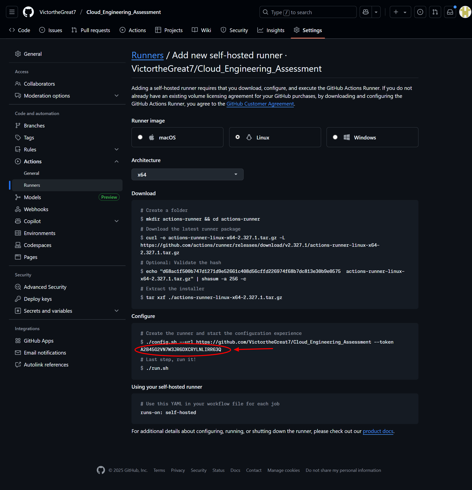

# Time API Infrastructure Project

A cloud-native infrastructure project that deploys a simple Flask-based time API to Azure Kubernetes Service (AKS) using automated Continuous Integration and Deployment (CI/CD) setups.

The repository contains three branches to support different deployment scenarios:

- [see `namecom_domain` branch](https://github.com/YOUR-USERNAME/YOUR-REPO-NAME/tree/namecom_domain) for use with a [name.com](https://www.name.com/) domain,
- [see `main` branch](https://github.com/YOUR-USERNAME/YOUR-REPO-NAME/tree/main) for use without a [name.com](https://www.name.com/) domain with a [Let's Encrypt](https://letsencrypt.org/) TLS Certificate or port 80 restricted at the Subnet level, and
- [see `self-hosted` branch](https://github.com/YOUR-USERNAME/YOUR-REPO-NAME/tree/self-hosted) for a version of the [`main` branch](https://github.com/YOUR-USERNAME/YOUR-REPO-NAME/tree/main) that restricts access to the AKS API server to a private VNet and uses a self-hosted GitHub Actions runner (within the same VNet) when there is a need to access it during CI/CD, eliminating the need to expose the cluster publicly.

This project is designed to demonstrate cloud engineering skills, including Infrastructure as Code (IaC), containerization, orchestration, and CI/CD automation.

## 🏗️ Architecture Overview

This project demonstrates a deployment of a simple API that returns the current UTC time. It includes the use of the following:

- **Application**: Simple Flask API that returns current UTC time
- **Containerisation**: Docker for building and test-running the application container
- **Orchestration**: Kubernetes for container orchestration
- **Cloud Infrastructure**: Azure Kubernetes Service (AKS) with networking, security, and monitoring for compute needs
- **CI/CD**: GitHub Actions for automated deployment
- **Monitoring**: Microsoft Azure Monitor, Log Analytics, and Grafana dashboards
- **Security**: GitHub Secrets, Security groups, Microsoft Azure Role Based Access Control, Network policies and isolating API Server access to a private VNet (when using the [`self-hosted` branch](https://github.com/YOUR-USERNAME/YOUR-REPO-NAME/tree/self-hosted))
- **Infrastructure as Code**: The use of Terraform and Bash scripts running Microsoft Azure CLI and GitHub CLI commands for scripting/automation purposes
- **SSL/TLS**: Automated TLS certificate issuance with Let's Encrypt for Name.com domain (when using the [`namecom_domain` branch](https://github.com/YOUR-USERNAME/YOUR-REPO-NAME/tree/namecom_domain))

## 📋 Prerequisites

Before getting started, ensure you have installed and configured the following tools and services for your local machine and CI/CD environment:

### Required Tools

- [Microsoft Azure CLI](https://docs.microsoft.com/en-us/cli/azure/install-azure-cli) configured for GitHub Actions
- [GitHub CLI](https://cli.github.com/) for secrets management
- [Terraform](https://www.terraform.io/downloads.html) >= 1.12.2
- [kubelogin](https://azure.github.io/kubelogin/install.html)
- [kubectl](https://kubernetes.io/docs/tasks/tools/) for Kubernetes management

### Required Accounts & Services

- **Microsoft Azure Account** with a student or paid subscription and appropriate permissions (an Owner role is preferable)
- **Docker Hub Account** for container registry
- **Domain Name** registered with [Name.com](https://name.com) for Name.com domain ([see `namecom_domain` branch](https://github.com/YOUR-USERNAME/YOUR-REPO-NAME/tree/namecom_domain))
- **GitHub Repository** for version control and CI/CD automation

### Required Permissions

- Microsoft Azure subscription with `Owner` role is preferable
- Permission to create and manage Microsoft Azure AD groups and service principals
- Domain management access to a [name.com](https://www.name.com/) domain (when using the [`namecom_domain` branch](https://github.com/YOUR-USERNAME/YOUR-REPO-NAME/tree/namecom_domain))

## 🚀 Quick Start

### 1. Fork and Clone the Repository

Fork this repository to your GitHub account (to fork other branches too, untick the copy only main branch option) and clone it to your local machine:

```bash
git clone https://github.com/YOUR-USERNAME/YOUR-REPO-NAME.git
cd YOUR-REPO-NAME
```

### 2. Set Up Microsoft Azure Service Principal

Create a service principal for GitHub Actions:

```bash
# Login to Microsoft Azure
az login --use-device-code

# Update the service_principal.sh script variables with your details before running it. You can find it here:
cd terraform/bash_scripts

# Run the service principal creation script
chmod +x service_principal.sh
./service_principal.sh
```

**Required Variables**:

- `SERVICE_PRINCIPAL_NAME`: Choose a unique name
- `SCOPE`: Your Microsoft Azure subscription ID
- `GITHUB_NAME`: Your GitHub username  
- `GITHUB_REPO`: Your repository name

A secrets.yaml file will be created with the details of the created service principal

### 3. Configure GitHub Secrets

Set up the required GitHub repository secrets. You can use the provided script:

```bash
chmod +x gh_secret.sh
# Edit the script with your values first
./gh_secret.sh
```

**Required Secrets**:

- `AZURE_CREDENTIALS`: JSON object with Microsoft Azure service principal details
- `ARM_CLIENT_ID`: Microsoft Azure service principal client ID
- `ARM_CLIENT_SECRET`: Microsoft Azure service principal client secret
- `ARM_SUBSCRIPTION_ID`: Your Microsoft Azure subscription ID
- `ARM_TENANT_ID`: Your Microsoft Azure tenant ID
- `MY_USER_OBJECT_ID`: Your Microsoft Azure AD user object ID
- `RUNNER_TOKEN`: GitHub Actions runner token for the self-hosted runner (when using the [`self-hosted` branch](https://github.com/YOUR-USERNAME/YOUR-REPO-NAME/tree/self-hosted)). Find out how [`here`](https://docs.github.com/en/actions/how-tos/manage-runners/self-hosted-runners/add-runners). The cloud-init file already follows the instructions listed. All you need to do is copy the time-limited token to be run with ./config.sh in the configure step. Just make sure you select Linux x64 architecture 
- `DOMAIN`: Your domain name (e.g., example.com) (when using the [`namecom_domain` branch](https://github.com/YOUR-USERNAME/YOUR-REPO-NAME/tree/namecom_domain))
- `DOMAIN_API_USERNAME`: Name.com API username (when using the [`namecom_domain` branch](https://github.com/YOUR-USERNAME/YOUR-REPO-NAME/tree/namecom_domain))
- `DOMAIN_API_TOKEN`: Name.com API token (when using the [`namecom_domain` branch](https://github.com/YOUR-USERNAME/YOUR-REPO-NAME/tree/namecom_domain))
- `DOCKER_USERNAME`: Docker Hub username
- `DOCKER_PASSWORD`: Docker Hub password/token

**Note**: For the needed Microsoft Azure account details, check secrets.yaml created by the [Service Principal creation](#2-set-up-microsoft-azure-service-principal) step. Comment out any variables not needed for a particular scenario (branch).

### 4. Update Configuration

Edit the following files with your specific details:

#### `terraform/bash_scripts/pre-apply.sh`

```bash
# Update these variables
RESOURCE_GROUP_NAME="" # Change this
STORAGE_ACCOUNT_NAME="" # Choose a unique name
CONTAINER_NAME="tfstate"
REGION="eastus"
```

#### `terraform/backend.tf`

```hcl
terraform {
  backend "azurerm" {
    resource_group_name = "" # Update this
    storage_account_name = ""  # Update this
    container_name = "tfstate"
    key = "terraform.tfstate"
  }
}
```

#### `terraform/providers.tf`

```hcl
provider "azurerm" {
  features {}

  subscription_id = "YOUR-SUBSCRIPTION-ID"  # Update this
}
```

#### `terraform/microservices/deploy.tf` (when using the [`namecom_domain` branch](https://github.com/YOUR-USERNAME/YOUR-REPO-NAME/tree/namecom_domain))

```hcl
# Update the domain name in the ingress configuration
rule {
  host = "api.YOUR-DOMAIN.com"  # Change this
  # ...
}
```

#### `terraform/provision.tf` (when using the [`namecom_domain` branch](https://github.com/YOUR-USERNAME/YOUR-REPO-NAME/tree/namecom_domain))

```hcl
# Update email address for Let's Encrypt
values = [
  <<-EOT
clusterIssuers:
  - name: certmanager
    spec:
      acme:
        email: "your-email@example.com"  # Change this
        # ...
EOT
]
```

### 5. Deploy Infrastructure

Uncomment or add on-push trigger in .github/workflows/build.yaml

```yaml
# on:
#   push:
#     branches:
#       - main
```

Push your changes to trigger the GitHub Actions workflow:

```bash
git add .
git commit -m "[YOUR COMMIT MESSAGE]"
git push origin main
```

The workflow will:

1. Build and test the Docker image
2. Push the image to Docker Hub
3. Provision part of Microsoft Azure infrastructure needed including the self-hosted runner with Terraform using a GitHub hosted Actions runner
4. Provision the rest of the infrastructure using the self-hosted runner
5. Deploy the application to AKS
6. Update DNS records on your Name.com domain if you have one (when using the [`namecom_domain` branch](https://github.com/YOUR-USERNAME/YOUR-REPO-NAME/tree/namecom_domain))

**Important**: You can only connect to the cluster in the [`self-hosted`](https://github.com/YOUR-USERNAME/YOUR-REPO-NAME/tree/self-hosted) scenario from you self-hosted runner. There is also an ssh command in the outputs printed after a successful `terraform apply` that you can use to connect to the self-hosted runner for any sort of troubleshooting or the other.

## 🏗️ Manual Deployment (Alternative)

If you prefer to deploy manually and you have updated the configuraton as specified above:

### Main Branch

#### 1. Create or confirm existing Terraform Backend

```bash
cd terraform/bash_scripts
chmod +x pre-apply.sh
./pre-apply.sh
```

#### 2. Provision Infrastructure and Deploy Application

```bash
cd ../
terraform init
terraform apply
```

#### 3. Test API endpoint

In the outputs printed after a successful `terraform apply`, you will see the ingress IP of the deployed API. You can test it using:

```bash
curl http://<your-ingress-ip>/time
```

or with just `http://<your-ingress-ip>/time` in your browser.

### namecom_domain Branch

#### 1. Create or Confirm [Backend](#1-create-or-confirm-existing-terraform-backend)

#### 2. Provision Infrastructure

```bash
cd ../
terraform init
terraform apply
```

#### 3. Deploy Application

```bash
# Move microservice configs
cd microservices/
mv * ../
cd ../

# Apply microservice deployment
terraform init
terraform apply
```

#### 3. Test API URL

```bash
curl http://<your-configured-subdomain>/time
```

or with just `http://<your-configured-subdomain>/time` in your browser.

### self-hosted Branch

#### 1. Initialize [Terraform Backend](#1-create-or-confirm-existing-terraform-backend)

#### 2. Provision Infrastructure and Self-Hosted Runner

```bash
cd ../
terraform init
terraform apply
```

#### 3. Deploy Application with Self-Hosted Runner

```bash
# Move microservice configs
cd deploy/
mv * ../
cd ../

# Create SSH keys for the self-hosted runner
ssh-keygen -t rsa -b 4096 -C "github-selfhosted-runner" -f ssh_keys/id_rsa

# Apply microservice deployment
terraform init
terraform apply
```

#### 4. Test API endpoint

In the outputs printed after a successful `terraform apply`, you will see the ingress IP of the deployed API. You can test it using:

```bash
curl http://<your-ingress-ip>/time
```

or with just `http://<your-ingress-ip>/time` in your browser.

**Important**: You can only [connect to the cluster](#useful-commands) in this scenario from you self-hosted runner. There is also an ssh command in the outputs printed after a successful `terraform apply` that you can use to connect to the self-hosted runner for any sort of troubleshooting or the other.

## 🔧 Local Application/Image Building and/or Testing

### Running the Application Locally

```bash
# Install dependencies
pip install Flask

# Run the application
python get_time.py

# Test the endpoint
curl http://localhost:5000/time
```

### Building and Testing Docker Image

```bash
# Build the image
docker build -t time-api:local .

# Run container
docker run -d -p 5000:5000 --name time-api-local time-api:local

# Test the endpoint
curl http://localhost:5000/time

# Clean up
docker stop time-api-local
docker rm time-api-local
```

## 📊 Monitoring and Observability

The project includes comprehensive monitoring:

- **Grafana Dashboard**: Visual monitoring interface
- **Prometheus**: Metrics scraping
<!-- - **Microsoft Azure Monitor**: Metrics collection and alerting
- **Microsoft Azure Log Analytics**: Centralized logging -->

Access your Grafana dashboard through the Microsoft Azure portal after deployment.

**Note**: Make sure to enamble Managed prometheus for the cluster in the Microsoft Azure portal. There's currently no way to do this via Terraform or any kind of automation.

## 🔒 Security Features

- **Network Policies**: Restrict communication to an as-needed basis
- **GitHub Secrets**: Secure storage of sensitive information
- **Service Principals**: Secure access for GitHub Actions
- **Microsoft Azure RBAC**: Role-based access control
- **SSL/TLS**: Automated certificate management (when using the [`namecom_domain` branch](https://github.com/YOUR-USERNAME/YOUR-REPO-NAME/tree/namecom_domain))
- **Network Security Groups**: Microsoft Azure Network-level security
- **Private Subnets**: Isolated network segments
- **Private Cluster**: Restricted access to the Kubernetes API server

## 🛠️ Troubleshooting

<!-- ### Common Issues

1. **SSL Certificate Issues**

   ```bash
   kubectl get certificates -n time-api
   kubectl describe certificate time-api-tls -n time-api
   ```

2. **Pod Connectivity Issues**

   ```bash
   kubectl get pods -n time-api
   kubectl logs -l app=time-api -n time-api
   ```

3. **Ingress Controller Issues**

   ```bash
   kubectl get svc -n nginx-ingress
   kubectl logs -l app.kubernetes.io/name=ingress-nginx -n nginx-ingress
   ``` -->

### Useful Commands

```bash
# Get AKS credentials
az aks get-credentials --resource-group RESOURCE_GROUP --name CLUSTER_NAME

# Kubernetes Authentication
kubelogin convert-kubeconfig -l azurecli

# Check application status
kubectl get all -n time-api

# View logs
kubectl logs -f deployment/time-api -n time-api

# Test internal connectivity
kubectl run test-pod --image=busybox -it --rm -- /bin/sh
# Inside the pod: wget -qO- http://time-api-service.time-api.svc.cluster.local/time
```

## 🧹 Cleanup

To destroy all Terraform resources:

**Using GitHub Actions**: Trigger the "Destroy Infrastructure" workflow manually from the GitHub Actions tab.

**Manual Cleanup**:

```bash
cd terraform
terraform destroy
```

**Note**: This will permanently delete all Microsoft Azure resources created with `terraform apply`.

## 📝 Project Structure

### For the main branch

```txt
├── .github/workflows/       # GitHub Actions CI/CD
│   ├── build.yaml             # Main deployment workflow
│   └── destroy.yaml           # Resource cleanup workflow
├── terraform/               # Infrastructure as Code (IaC) and automation (Terraform modules, Bash scripts)
│   ├── bash_scripts/          # Helper scripts
│   │   ├── gh_secret.sh         # GitHub secrets management script
│   │   ├── pre-apply.sh         # Pre-apply script for Terraform backend setup
│   │   └── service_principal.sh # Microsoft Azure service principal creation script
│   ├── backend.tf             # Terraform backend configuration
│   ├── data.tf                # Data sources for existing resources
│   ├── deploy.tf              # Time API deployment Terraform configuration file
│   ├── main.tf                # Main Terraform entry point (K8S Cluster resource creation)
│   ├── monitoring.tf          # Monitoring and observability configuration
│   ├── netpolicy.tf           # Cluster Network policies configuration
│   ├── network.tf             # Microsoft Azure Cloud Networking configuration
│   ├── outputs.tf             # Terraform output definitions
│   ├── permissions.tf         # Microsoft Azure RBAC permissions configuration
│   ├── providers.tf           # Terraform provider configuration
│   ├── provision.tf           # Kubernetes Clsuter provisioning file
│   ├── terraform.tfvars.json  # Variable values (auto-generated in GitHub Actions runner from GitHub secrets)
│   └── variables.tf           # Terraform variable definitions
├── .gitignore               # Git ignore rules
├── Dockerfile               # Container image definition
├── get_time.py              # Flask application code
└── README.md                # This file
```

### For the namecom_domain branch

```txt
├── .github/workflows/       # GitHub Actions CI/CD
│   ├── build.yaml             # Main deployment workflow
│   └── destroy.yaml           # Resource cleanup workflow
├── terraform/               # Infrastructure as Code (IaC) and automation (Terraform modules, Bash scripts)
│   ├── bash_scripts/          # Helper scripts
│   │   ├── gh_secret.sh         # GitHub secrets management script
│   │   ├── pre-apply.sh         # Pre-apply script for Terraform backend setup
│   │   └── service_principal.sh # Microsoft Azure service principal creation script
│   ├── microservices/         # Contains application deployment Terraform configuration files
│   │   └── deploy.tf            # Time API deployment Terraform configuration file
│   ├── backend.tf             # Terraform backend configuration
│   ├── data.tf                # Data sources for existing resources
│   ├── main.tf                # Main Terraform entry point (K8S Cluster resource creation)
│   ├── monitoring.tf          # Monitoring and observability configuration
│   ├── netpolicy.tf           # Cluster Network policies configuration
│   ├── network.tf             # Microsoft Azure Cloud Networking configuration
│   ├── outputs.tf             # Terraform output definitions
│   ├── permissions.tf         # Microsoft Azure RBAC permissions configuration
│   ├── providers.tf           # Terraform provider configuration
│   ├── provision.tf           # Kubernetes Clsuter provisioning file
│   ├── terraform.tfvars.json  # Variable values (auto-generated in GitHub Actions runner from GitHub secrets)
│   └── variables.tf           # Terraform variable definitions
├── .gitignore               # Git ignore rules
├── Dockerfile               # Container image definition
├── get_time.py              # Flask application code
└── README.md                # This file
```

### For the self-hosted branch

```txt
├── .github/workflows/       # GitHub Actions CI/CD
│   ├── build.yaml             # Main deployment workflow
│   ├── destroy.yaml           # Resource cleanup workflow
│   └── integrate.yaml         # Subsequent infrastructure or deployment changes workflow
├── terraform/               # Infrastructure as Code (IaC) and automation (Terraform modules, Bash scripts)
│   ├── bash_scripts/          # Helper scripts
│   │   ├── get-aks-cred.sh      # Script to get AKS credentials
│   │   ├── gh_secret.sh         # GitHub secrets management script
│   │   ├── pre-apply.sh         # Pre-apply script for Terraform backend setup
│   │   └── service_principal.sh # Microsoft Azure service principal creation script
│   ├── deploy/                # Contains application deployment Terraform configuration files
│   │   ├── data.tf              # Data sources
│   │   ├── deploy.tf            # Time API deployment Terraform configuration file
│   │   ├── monitoring.tf        # Monitoring and observability configuration
│   │   ├── netpolicy.tf         # Cluster Network policies configuration
│   │   ├── permissions.tf       # Microsoft Azure RBAC permissions configuration
│   │   └── provision.tf         # Kubernetes Cluster provisioning file
│   ├── ssh_keys/              # An empty folder to store SSH keys needed for the self-hosted runner
│   ├── backend.tf             # Terraform backend configuration
│   ├── cloud-init.yaml.tpl    # Cloud-init template for self-hosted runner setup
│   ├── main.tf                # Main Terraform entry point (K8S Cluster resource group and Self-Hosted GitHub Runner creation)
│   ├── network.tf             # Microsoft Azure Cloud Networking configuration
│   ├── outputs.tf             # Terraform output definitions
│   ├── providers.tf           # Terraform provider configuration
│   ├── terraform.tfvars.json  # Variable values (auto-generated in GitHub Actions runner from GitHub secrets)
│   └── variables.tf           # Terraform variable definitions
├── .gitignore               # Git ignore rules
├── Dockerfile               # Container image definition
├── get_time.py              # Flask application code
└── README.md                # This file
```

## 🤝 Contributing

1. Fork the repository
2. Create a feature branch: `git checkout -b feature-name`
3. Make your changes and commit: `git commit -am 'Add feature'`
4. Push to the branch: `git push origin feature-name`
5. Submit a pull request

## 🆘 Support

If you encounter issues:

1. Check the [Troubleshooting](#️-troubleshooting) section
2. Review the GitHub Actions logs
3. Check Microsoft Azure portal for resource status
4. Open an issue in this repository

## 🔗 Useful Links

- [Name.com API Documentation](https://www.name.com/api-docs) (when using the [`namecom_domain` branch](https://github.com/YOUR-USERNAME/YOUR-REPO-NAME/tree/namecom_domain))
- [Microsoft Azure Documentation](https://docs.microsoft.com/en-us/azure/)
- [Docker Documentation](https://docs.docker.com/)
- [GitHub Actions Documentation](https://docs.github.com/en/actions)
- [Terraform Documentation](https://registry.terraform.io/)
- [Terraform Microsoft Azure Provider](https://registry.terraform.io/providers/hashicorp/azurerm/latest/docs)
- [Terraform Kubernetes Provider](https://registry.terraform.io/providers/hashicorp/kubernetes/latest/docs)
- [Terraform Helm Provider](https://registry.terraform.io/providers/hashicorp/helm/latest/docs)
- [Terraform kubectl Provider](https://registry.terraform.io/providers/alekc/kubectl/latest/docs)
- [Terraform NGINX Ingress Controller Module](https://registry.terraform.io/modules/terraform-iaac/nginx-controller/helm/latest)
- [Terraform Cert Manager Module](https://registry.terraform.io/modules/terraform-iaac/cert-manager/helm/latest)
- [Azure Kubernetes Service Documentation](https://docs.microsoft.com/en-us/azure/aks/)
- [Kubernetes Documentation](https://kubernetes.io/docs/)
- [Let's Encrypt Documentation](https://letsencrypt.org/docs/)

---

**Disclaimer**: This project is designed for learning and demonstration purposes. For production use, consider additional security hardening, cost optimization, and compliance requirements specific to your organization.
